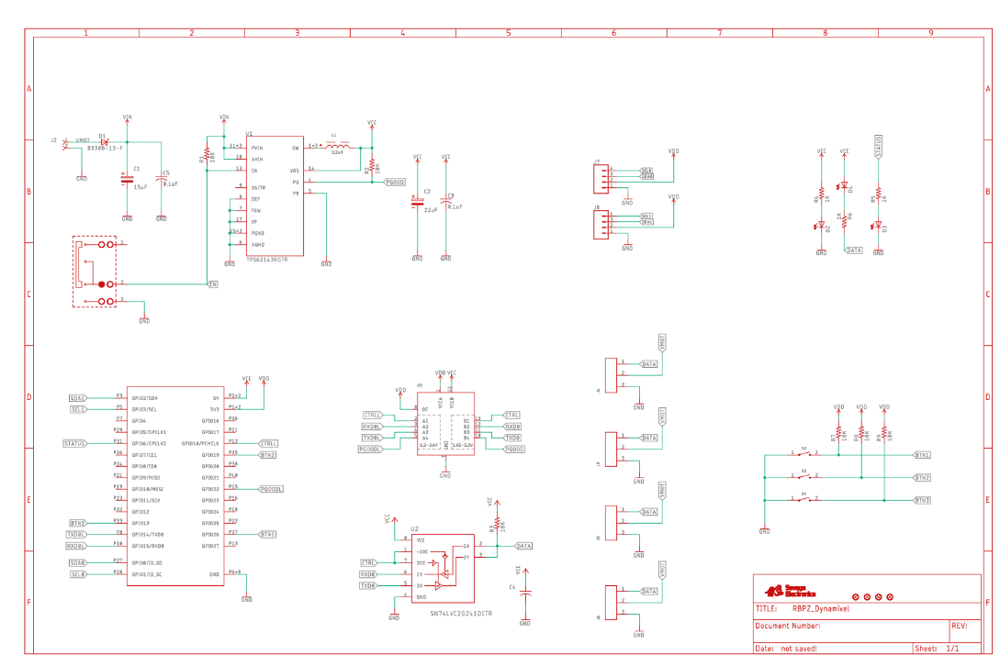

# soft-arm
The project is for the University of Bristol MSc bio-robotics dissertation, 'Bio-inspired telepresence avatars for embodied communication'. Aims to develop a robot with two soft arms, which can mimic the actions of a person's arms in real time.


***Note: Please open the Readme.md with another markdown viewer, since some features are not supported by Git Hub.***

## Directory Structure

<font color=#9400D3>\mechanism</font> (includes the mechanical structure design of the robot)

​			<font color=#9370DB>***.stl files</font>: For 3D printing purpose.

​			<font color=#9370DB>***.dxf files</font>: For laser cutting purpose.

​			<font color=#9370DB>***.f3d</font>: For viewing and editing purposes. Can be opened by 'Fusion 360'.

​			<font color=#9370DB>***.f3z</font>: This is a zip file, that contains .f3d files.


<font color=#9400D3>\hardware</font> (includes the basic description and driver of all used hardware)

​			<font color=#9370DB>\ raspberry pi zero W</font>: A quick start guide, a schematic and a mechanical specification of raspberry pi zero W are in it.

​			<font color=#9370DB>\IMU_Selection</font>: Includes the specifications and the comparing results of the IMUs. Both CJMCU-BNO055 and MPU9250 meet the needs (contain a 3-axis accelerometer and 3-axis gyroscope) with decent performance. However, Raspberry Pi Zero W doesn't have the <font color=#996B1F>I2C clock stretching feature</font> which is essential to drive BNO055. In addition, BNO055 is more expensive than MPU9250. Thus, MPU9250 was chosen to build this project.

​			<font color=#9370DB>\AX12_servo</font>: Contains the datasheet of AX12_servo, helpful websites of AX12 Dynamixel hat of raspberry pi zero and documents of AX12 python library.


<font color=#9400D3>\experiment</font> (includes the explanations, source codes and results of each experiment)

​			<font color=#9370DB>\1_MPU9250_test</font>:

​			<font color=#9370DB>\2_AX12_test</font>:

​			<font color=#9370DB>\3_UDP_test</font>:

​			<font color=#9370DB>\4_baseline_test</font>:

## Mechanism Description

3D printing Components:

<center>
    
    <br>
    <div style="color:grey">
        The labelled diagram of fusion 360 mechanism design. 
    </div>
</center>

***Note: The 'AX_12 motor' part is not for 3D printing but for reference. The .stl file of the ax_12 motor can be downloaded from  [AX_12 STL](https://en.robotis.com/service/downloadpage.php?ca_id=70).***

Active wire:

<center>
    
    <br>
    <div style="color:grey">
        0.4mm Nylon Fishing Wire, 6.0 Spool Clear Monofilament Line.
    </div>
</center>

Passive wire:

<center>
    
    <br>
    <div style="color:grey">
        5mm ID * 8mm OD Black Rubber Tube.
    </div>
</center>

##  Hardware Description

​	Rather than using the Raspberry Pi directly, a Dynamixel Hat of Raspberry Pi Zero helps control the motors and IMUs. There are two useful websites showing the hax's details:

   - [Raspberry Pi Zero Dynamixel Hat - Hackster.io](https://www.hackster.io/JosueAlejandroSavage/raspberry-pi-zero-dynamixel-hat-e59516)

   - [Raspberry Pi Zero Dynamixel Hat – Savage Electronics Blog](https://savageelectronics.com/raspberry-pi-zero-dynamixel-hat/)

     <center>
         
         <br>
         <div style="color:grey">
     		The pinout of the Dynamixel Hat.
         </div>
     </center>

     ​	The Raspberry Pi can both control the motors by sending instructions through UART and read data from IMUs by sending requests through I2C to the Hat. The following pictures illustrate what connectors should be applied to connect the motors and IMUs to the Hat in what order.

     <center>
         
         <br>
         <div style="color:grey">
             The schematic of the Dynamixel Hat.
         </div>
     </center>

     <center>
         
         <br>
         <div style="color:grey">
             The BOM of the Dynamixel Hat.
         </div>
     </center>
     
     

## Set-up Steps Before Experiments

### Raspberry Pi Configuration

```shell
sudo raspi-config	# Enter the Raspberry Pi Software Configuration Tool.
```

<center>
    
    <br>
    <div style="color:grey">
        Raspberry Pi configuration.	Choose the third option.
    </div>
</center>

​	Enable the I2C and serial port interface.

### C Programming Streamline

```shell
sudo apt-get update
sudo apt-get upgrade
sudo apt-get install vim
vim xxx.c		# Or using the other edit tool like nano. 
gcc xxx.c -o xxx	# '-o' for renaming the output file. More guides can be found by 'gcc --help'.
chmod -x xxx	# Add the execution authority to the file output from gcc.
./xxx	# Run the program.
```


### Python Programming Environment

This project uses CircuitPython, which mainly developed by Adafruit and is a fork from MicroPython, to control the GPIOs and other hardwares on the raspberry Pi. To install CircuitPython, [this website](https://learn.adafruit.com/circuitpython-on-raspberrypi-linux/installing-circuitpython-on-raspberry-pi) can be referred. For convenience, the streamlined steps are shown here.

```shell
sudo apt-get update
sudo apt-get upgrade
sudo apt-get install python3-pip
sudo pip3 install --upgrade setuptools	
```

```shell
cd
sudo pip3 install --upgrade adafruit-python-shell
wget https://raw.githubusercontent.com/adafruit/Raspberry-Pi-Installer-Scripts/master/raspi-blinka.py
sudo python3 raspi-binka.py
```

## Experiments

Compile xxx.c by:
```shell
gcc -o xxx -O0 -I inc/ src/ -lmath -lbcm2835
```
Then execute the output file xxx to see the effect.

### 1. UART

### 2. I2C

### 3. TCP


## Revisions

v0.0 Ongoings
